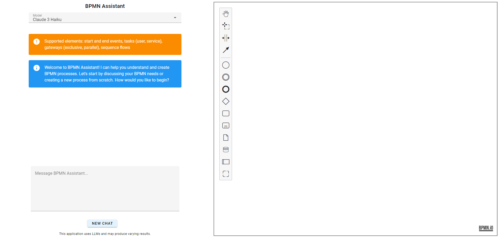

# BPMN Assistant

BPMN Assistant is an application that uses Large Language Models (LLMs) to assist with creating, editing, and
interpreting Business Process Model and Notation (BPMN) diagrams.

## Quickstart

1. Clone the repository

```
git clone https://github.com/jtlicardo/bpmn-assistant.git
```

```
cd bpmn-assistant
```

2. Set up your environment variables

<details>
<summary>Linux, macOS</summary>

```
cd src/bpmn_assistant
```

```
cp .env.example .env
```

</details>

<details>
<summary>Windows</summary>

```
cd src\bpmn_assistant
```

```
copy .env.example .env
```

</details>

3. Open the `.env` file and replace the placeholder values with your actual API keys.

4. Build and run the application

```
docker-compose up --build
```

5. Open your browser and go to `http://localhost:8080`

## Prerequisites

- [Docker](https://docs.docker.com/get-docker/)
- [Docker Compose](https://docs.docker.com/compose/install/)
- [OpenAI API key](https://platform.openai.com/docs/quickstart) or [Anthropic API key](https://console.anthropic.com/)

## Supported models

### OpenAI

* GPT-4o mini
* GPT-4o

### Anthropic

* Claude 3 Haiku
* Claude 3.5 Sonnet

## Screenshots




## Core features

1. Diagram creation - Generates BPMN diagrams based on text descriptions.
2. Diagram editing - Modifies BPMN diagrams based on user input.
3. Diagram interpretation - Provides text descriptions of BPMN diagrams.
4. Drag-and-drop functionality - Users can drag and drop BPMN processes (containing only supported elements) into the
   editor, then ask the LLM to edit or explain them.

## Supported elements

The application currently supports a subset of BPMN elements:

* Task
* User task
* Service task
* Exclusive gateway
* Parallel gateway
* Start event
* End event

## Limitations

* The application currently only supports a subset of BPMN elements.
* The AI assistant does not "see" manual edits made to the diagram. It always responds based on its last generated
  version. Keep this in mind when interacting with the assistant after making manual changes.
* Pools and lanes are not supported.

## Future improvements

* Expanded BPMN element support
* Implementing LLM awareness of manual edits to the diagram

## Contact

If you have any questions or feedback, please open an issue on this GitHub repository.