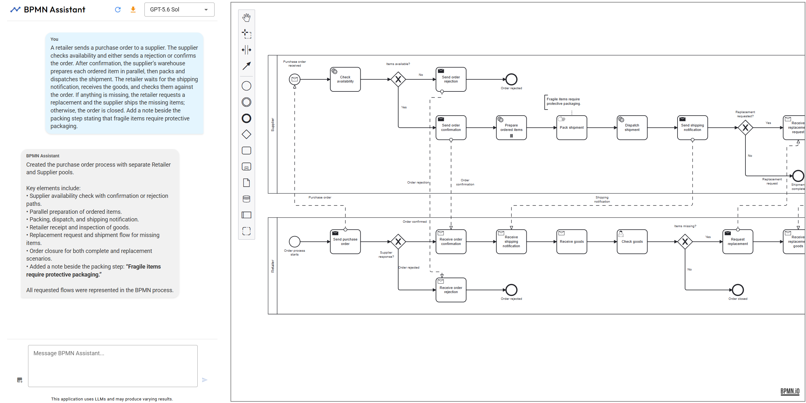

<p align="center">
  
</p>

# Turn process descriptions into editable BPMN diagrams

Describe a business process in plain language, refine it through conversation, and export a `.bpmn` file. An open-source AI assistant for drafting, exploring, and explaining business processes.

[](LICENSE)
[](https://github.com/jtlicardo/bpmn-assistant/actions/workflows/ci.yml)
[](https://github.com/jtlicardo/bpmn-assistant/stargazers)

**[Try the app](https://bpmn-frontend.onrender.com)** · [Run locally](#run-locally-with-docker) · [Example prompts](#try-a-process) · [Research paper](https://doi.org/10.3390/app16052213)

Bring an OpenAI or Anthropic API key to get started.



## From an idea to a process you can edit

- **Describe your process.** Generate BPMN diagrams with tasks, gateways, events, pools, lanes, and message flows.
- **Refine it in conversation.** Ask for an approval step, an alternative path, or a new participant.
- **Start with existing work.** Import a BPMN file with drag and drop, or use an image to create or modify a process.
- **Ask about the diagram.** Explore how an existing process works through questions.
- **Keep an editable result.** Adjust the diagram in the visual editor and download it as a `.bpmn` file.
- **Run it your way.** Use the hosted app or run locally with Docker and your own API keys.

Useful for analysts drafting workflows, teams discussing process changes, and students learning BPMN.

## Try a process

Open the **[hosted app](https://bpmn-frontend.onrender.com)**, enter an API key, choose a model, and try this prompt:

> Create a purchase request process. An employee submits a request. A manager reviews it. If approved, the purchasing team places the order and the process ends. If rejected, notify the employee and end the process. Use lanes for Employee, Manager, and Purchasing.

Then refine it:

> Add a finance approval step for requests over €5,000 before the purchasing team places the order. If finance rejects the request, notify the employee.

Or ask a question:

> Explain the approval paths in this process and who is responsible for each step.

These are example prompts to explore; generated results can vary. Review the diagram before using it in your work.

## Quickstart

### Use the hosted app

No local installation required. Visit **[bpmn-frontend.onrender.com](https://bpmn-frontend.onrender.com)** and provide an OpenAI or Anthropic API key in the interface. Model API usage is billed by your provider.

The hosted interface keeps keys in your browser's session storage and sends them to the backend to make model requests. Your process content is sent to the selected model provider for AI features.

### Run locally with Docker

You need Docker with Docker Compose and at least one OpenAI or Anthropic API key.

**1. Clone the repository.**

```sh
git clone https://github.com/jtlicardo/bpmn-assistant.git
cd bpmn-assistant
```

**2. Create your environment file from the repository root.**

Linux / macOS:

```sh
cp src/bpmn_assistant/.env.example src/bpmn_assistant/.env
```

Windows PowerShell:

```powershell
Copy-Item src/bpmn_assistant/.env.example src/bpmn_assistant/.env
```

Edit `src/bpmn_assistant/.env` and fill in at least one key:

```dotenv
OPENAI_API_KEY='your-openai-api-key'
ANTHROPIC_API_KEY=''
```

To use Anthropic instead, fill in `ANTHROPIC_API_KEY` and leave the OpenAI value empty. You can also configure both.

**3. Start the app from the repository root.**

```sh
docker compose up --build
```

Open **[localhost:8080](http://localhost:8080)**. Local deployment reads API keys from the backend environment file; AI features still call the selected model provider.

## Supported models

### OpenAI

* GPT-5.6 Sol
* GPT-5.6 Luna

### Anthropic

* Claude Opus 5
* Claude Sonnet 5

## Supported elements

The application currently supports a subset of BPMN elements, including pools, lanes, and message flows:

### Tasks
* Task
* User task
* Service task
* Send task
* Receive task
* Business rule task
* Manual task
* Script task

Tasks also support loop and sequential/parallel multi-instance markers.

### Gateways
* Exclusive gateway
* Parallel gateway
* Inclusive gateway

### Events
**Start events**
* Start event
* Timer start event
* Message start event
* Signal and conditional start events

**End events**
* End event
* Message end event
* Signal, error, escalation, terminate, and compensation end events

**Intermediate events**
* Intermediate throw event (generic)
* Intermediate throw event (message)
* Intermediate catch event (generic)
* Intermediate catch event (timer)
* Intermediate catch event (message)
* Signal and link intermediate events (throw/catch)
* Escalation and compensation intermediate throw events
* Conditional intermediate catch event

Text annotations and their associations are also supported.

## Limitations

* The AI assistant does not "see" manual edits made to the diagram. It always responds based on its last generated
  version. Keep this in mind when interacting with the assistant after making manual changes.
* Nested lanes are not supported yet.
* Each non-empty pool must contain exactly one start event.

## Paper

[BPMN Assistant: An LLM-Based Approach to Business Process Modeling](https://doi.org/10.3390/app16052213)

## Contribute

Bug reports, example processes, and pull requests are welcome.

- **Found a modeling issue?** [Open an issue](https://github.com/jtlicardo/bpmn-assistant/issues) with the prompt, selected model, expected behavior, and a screenshot or BPMN file that reproduces it. Remove API keys and private process details before sharing.
- **Have a feature idea?** Describe the process you want to model and what is missing.

## License and contact

Released under the [MIT License](LICENSE).

If you have any questions or feedback, please open an issue on this GitHub repository or [contact me](https://jtlicardo.com/).
