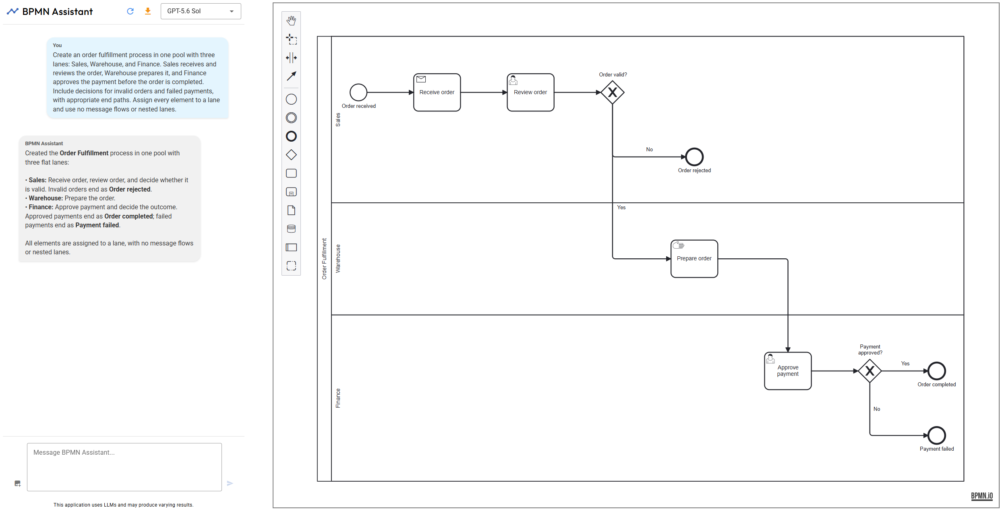

[](LICENSE)
[](https://github.com/jtlicardo/bpmn-assistant/stargazers)
[](https://github.com/jtlicardo/bpmn-assistant/actions/workflows/ci.yml)


Describe a business process. Get a BPMN diagram.

[Try BPMN Assistant](https://bpmn-frontend.onrender.com)



https://github.com/user-attachments/assets/2f17bd99-f6fb-47a2-b33e-2190c3a834e2

## Quickstart

### Option 1: Use the hosted version

The easiest way to get started - no setup required!

Visit **[bpmn-frontend.onrender.com](https://bpmn-frontend.onrender.com)** and provide your own API keys directly in the interface. Your keys are stored locally in your browser and never stored on any servers.

### Option 2: Run locally with Docker

1. Clone the repository

```
git clone https://github.com/jtlicardo/bpmn-assistant.git
```

```
cd bpmn-assistant
```

2. Set up your environment variables

<details>
<summary>Linux, macOS</summary>

```
cd src/bpmn_assistant
```

```
cp .env.example .env
```

</details>

<details>
<summary>Windows</summary>

```
cd src\bpmn_assistant
```

```
copy .env.example .env
```

</details>

3. Open the `.env` file and replace the placeholder values with your actual API keys.

4. Build and run the application

```
docker-compose up --build
```

5. Open your browser and go to `http://localhost:8080`

## Prerequisites

At least one of the following API keys:
- [OpenAI API key](https://platform.openai.com/docs/quickstart)
- [Anthropic API key](https://console.anthropic.com/)

Note: You can use any combination of the API keys above, but at least one is required to use the app.

Additional prerequisites for local deployment:
- [Docker](https://docs.docker.com/get-docker/)
- [Docker Compose](https://docs.docker.com/compose/install/)

## Supported models

### OpenAI

* GPT-5.6 Sol
* GPT-5.6 Luna

### Anthropic

* Claude Opus 4.8
* Claude Sonnet 5

## Core features

**Create** — Generate BPMN diagrams from plain-language descriptions, including pools and lanes.

**Edit** — Modify processes conversationally or import BPMN files with drag and drop.

**Understand** — Ask questions about existing diagrams or use images to create and modify processes.

## Supported elements

The application currently supports a subset of BPMN elements, including pools and lanes:

### Tasks
* Task
* User task
* Service task
* Send task
* Receive task
* Business rule task
* Manual task
* Script task

### Gateways
* Exclusive gateway
* Parallel gateway
* Inclusive gateway

### Events
**Start events**
* Start event
* Timer start event
* Message start event

**End events**
* End event
* Message end event

**Intermediate events**
* Intermediate throw event (generic)
* Intermediate throw event (message)
* Intermediate catch event (generic)
* Intermediate catch event (timer)
* Intermediate catch event (message)

## Limitations

* The AI assistant does not "see" manual edits made to the diagram. It always responds based on its last generated
  version. Keep this in mind when interacting with the assistant after making manual changes.
* Message flows and nested lanes are not supported yet.
* Each non-empty pool must contain exactly one start event.

## Paper

[BPMN Assistant: An LLM-Based Approach to Business Process Modeling](https://doi.org/10.3390/app16052213)

## Contact

If you have any questions or feedback, please open an issue on this GitHub repository or [contact me](https://jtlicardo.com/).
